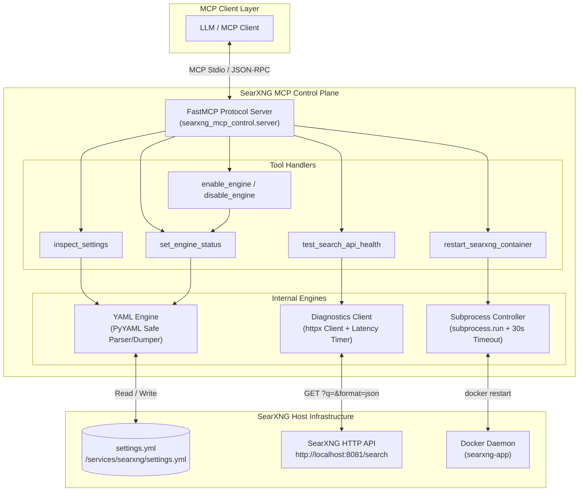
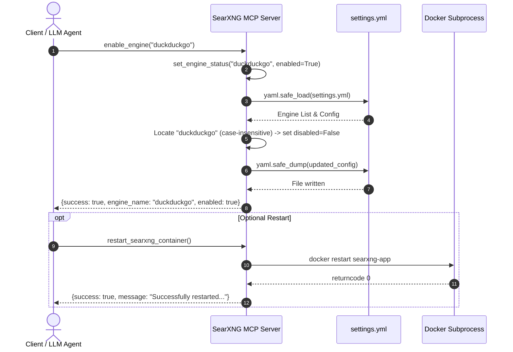
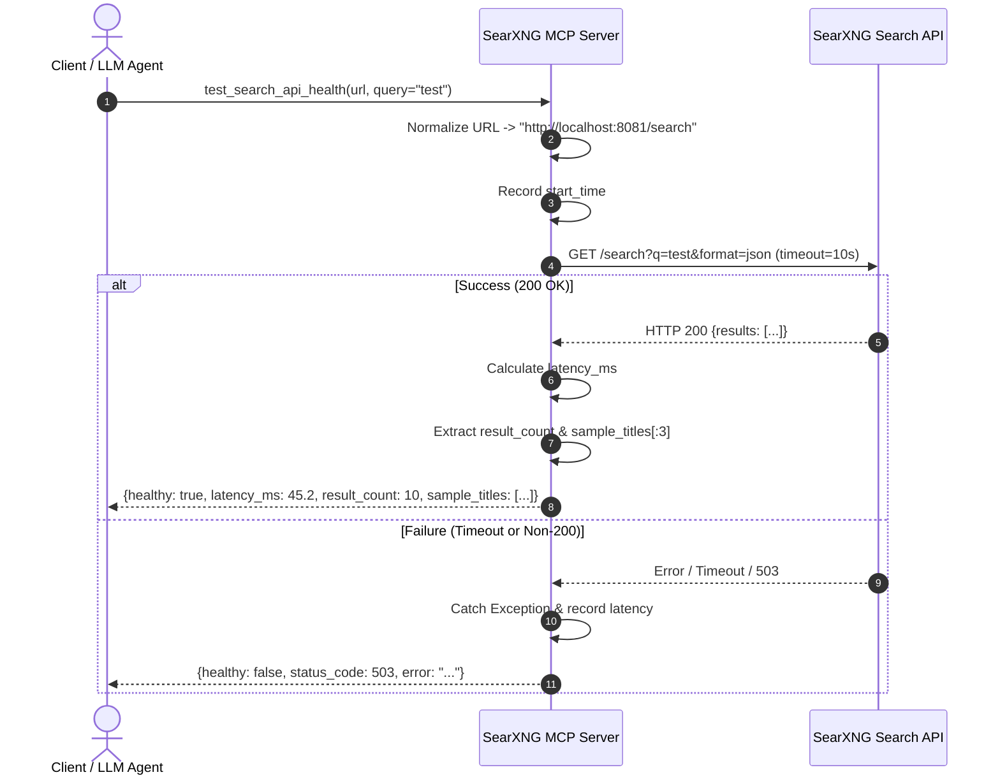

# SearXNG MCP Control Server Architecture

## 1. Executive Summary

The **SearXNG MCP Control Server** (`searxng-mcp-control`) is a Model Context Protocol (MCP) server designed to act as an automated control plane for self-hosted [SearXNG](https://github.com/searxng/searxng) metasearch instances. It exposes high-level, standardized MCP tools allowing LLM agents, developer workflows, and administrative assistants to:

1. **Inspect & Audit Configuration**: Read SearXNG's `settings.yml`, extract engine states (enabled vs. disabled), and review server-level parameters.
2. **Dynamically Manage Search Engines**: Enable, disable, or register search engines with in-place persistence and case-insensitive matching.
3. **Run API Health Checks & Latency Diagnostics**: Issue live queries, measure end-to-end latency in milliseconds, and validate JSON payloads.
4. **Control Container Lifecycle**: Safely trigger restarts of the underlying Dockerized SearXNG container (`searxng-app`).

---

## 2. High-Level Architecture

The system operates as an intermediary between MCP-compliant clients (e.g., Claude Desktop, Antigravity, Cline, Cursor) and the SearXNG infrastructure (configuration files, HTTP search endpoints, and Docker daemon).



---

## 3. Core Subsystems

### 3.1. Configuration Management Subsystem

The configuration subsystem provides safe, bidirectional interaction with SearXNG's YAML configuration (`settings.yml`).

- **File Path Resolution**:
  Defaults to the `SEARXNG_SETTINGS_PATH` environment variable or `/home/ddoctorm/services/searxng/settings.yml`. Can be overridden per-call.
- **Parsing Mechanics**:
  Uses `yaml.safe_load()` to mitigate arbitrary code execution risks.
- **Engine State Normalization**:
  SearXNG configurations store engines in an `engines` list. `inspect_settings` aggregates these into:
  - `enabled_engines`: Engines where `disabled != True`.
  - `disabled_engines`: Engines explicitly marked with `disabled: True`.
  - `engine_summary`: Metrics containing total, enabled, and disabled counts.
- **Safe Mutation & Serialization**:
  `set_engine_status` performs case-insensitive name comparisons against existing engines. If found, the `disabled` property is toggled. If not found, a new engine object is appended to the list. Serialized using `yaml.safe_dump(sort_keys=False, default_flow_style=False)` to preserve human-readable YAML formatting.

### 3.2. Search API Health & Diagnostics Subsystem

The diagnostic subsystem performs automated sanity checking on the SearXNG search endpoint via `test_search_api_health`.

- **Endpoint Normalization**:
  Accepts a base URL (e.g., `http://localhost:8081` or `http://localhost:8081/`) and automatically normalizes it to the JSON query endpoint `/search`.
- **Latency Instrumentation**:
  Accurately calculates wall-clock latency in milliseconds (`(time.time() - start_time) * 1000`) rounded to two decimal places.
- **Payload Verification**:
  Verifies HTTP 200 status and parses the response body as JSON. Extracts the total result count and a preview sample of up to 3 result titles (`sample_titles`).
- **Resilience**:
  Captures network timeouts, connection refused exceptions, and HTTP status codes cleanly without crashing the MCP server.

### 3.3. Container Lifecycle Subsystem

The container subsystem enables controlled Docker container restarts via `restart_searxng_container`.

- **Execution Model**:
  Invokes `subprocess.run(["docker", "restart", target], capture_output=True, text=True, timeout=30)`.
- **Safety Boundaries**:
  - Bound by a strict 30-second timeout to prevent deadlocks or hung processes.
  - Returns structured exit codes, standard output, and standard error for detailed diagnostic logging.

---

## 4. MCP Tools Reference

| Tool Name | Parameters | Return Type | Description |
| --- | --- | --- | --- |
| [`inspect_settings`](file:///home/ddoctorm/projects/TheNovaNodes/searxng-mcp-control/src/searxng_mcp_control/server.py#L26-L80) | `settings_path` (Optional[str]) | `Dict[str, Any]` | Inspects SearXNG settings, general/server/outgoing configs, and active/disabled search engines. |
| [`set_engine_status`](file:///home/ddoctorm/projects/TheNovaNodes/searxng-mcp-control/src/searxng_mcp_control/server.py#L83-L136) | `engine_name` (str), `enabled` (bool), `settings_path` (Optional[str]) | `Dict[str, Any]` | Explicitly enables or disables a search engine in `settings.yml`. |
| [`enable_engine`](file:///home/ddoctorm/projects/TheNovaNodes/searxng-mcp-control/src/searxng_mcp_control/server.py#L139-L149) | `engine_name` (str), `settings_path` (Optional[str]) | `Dict[str, Any]` | Convenience wrapper to enable a search engine. |
| [`disable_engine`](file:///home/ddoctorm/projects/TheNovaNodes/searxng-mcp-control/src/searxng_mcp_control/server.py#L152-L162) | `engine_name` (str), `settings_path` (Optional[str]) | `Dict[str, Any]` | Convenience wrapper to disable a search engine. |
| [`test_search_api_health`](file:///home/ddoctorm/projects/TheNovaNodes/searxng-mcp-control/src/searxng_mcp_control/server.py#L165-L224) | `url` (Optional[str]), `query` (str = "healthcheck") | `Dict[str, Any]` | Queries the search endpoint, calculates latency, and verifies JSON results. |
| [`restart_searxng_container`](file:///home/ddoctorm/projects/TheNovaNodes/searxng-mcp-control/src/searxng_mcp_control/server.py#L226-L264) | `container_name` (Optional[str]) | `Dict[str, Any]` | Restarts the SearXNG Docker container via subprocess. |

---

## 5. Sequence Flows

### 5.1. Engine Status Modification



### 5.2. Search API Health Check



---

## 6. Error Handling & Security Model

1. **Safe YAML Operations**:
   All YAML deserialization and serialization use `yaml.safe_load` and `yaml.safe_dump` respectively. This prevents arbitrary Python object instantiation and code injection vulnerabilities.
2. **Subprocess Isolation**:
   The `restart_searxng_container` tool invokes Docker commands using argument arrays (not `shell=True`), eliminating shell-injection vectors. Subprocess execution is guarded by a 30-second `timeout` to avoid thread exhaustion.
3. **HTTP Connection Boundaries**:
   HTTP requests use `httpx.Client` with explicit timeouts (`timeout=10.0`) and follow redirects safely.
4. **Structured Error Payloads**:
   All MCP tools return structured JSON envelopes with `success: False` (or `healthy: False`) and descriptive error strings, ensuring the calling LLM can handle issues gracefully without tool call crashes.

---

## 7. Testing Strategy

The test suite in [`tests/test_server.py`](file:///home/ddoctorm/projects/TheNovaNodes/searxng-mcp-control/tests/test_server.py) implements automated verification with 100% test pass rate and high coverage:

- **Isolated Unit Testing**: Uses `tmp_path` fixtures to test YAML parsing, corrupted files, empty configurations, and atomic modifications.
- **Mocked HTTP & Subprocess Testing**: Uses `unittest.mock` to verify network failure modes (timeouts, 500s, malformed JSON) and Docker subprocess outcomes (returncode 0, non-zero exit, timeout exceptions, missing binary).
- **Live Environment Verification**: Includes non-destructive validation against real host configurations and live search endpoints when available.

To run the test suite:

```bash
pytest -v
# or with coverage
pytest --cov=searxng_mcp_control --cov-report=term-missing
```

---

## 8. Configuration Reference

| Environment Variable | Default Value | Purpose |
| --- | --- | --- |
| `SEARXNG_SETTINGS_PATH` | `/home/ddoctorm/services/searxng/settings.yml` | Location of SearXNG's `settings.yml` configuration file. |
| `SEARXNG_URL` | `http://localhost:8081` | Default endpoint for SearXNG API health checks. |
| `SEARXNG_CONTAINER_NAME` | `searxng-app` | Target Docker container name for container lifecycle tools. |
