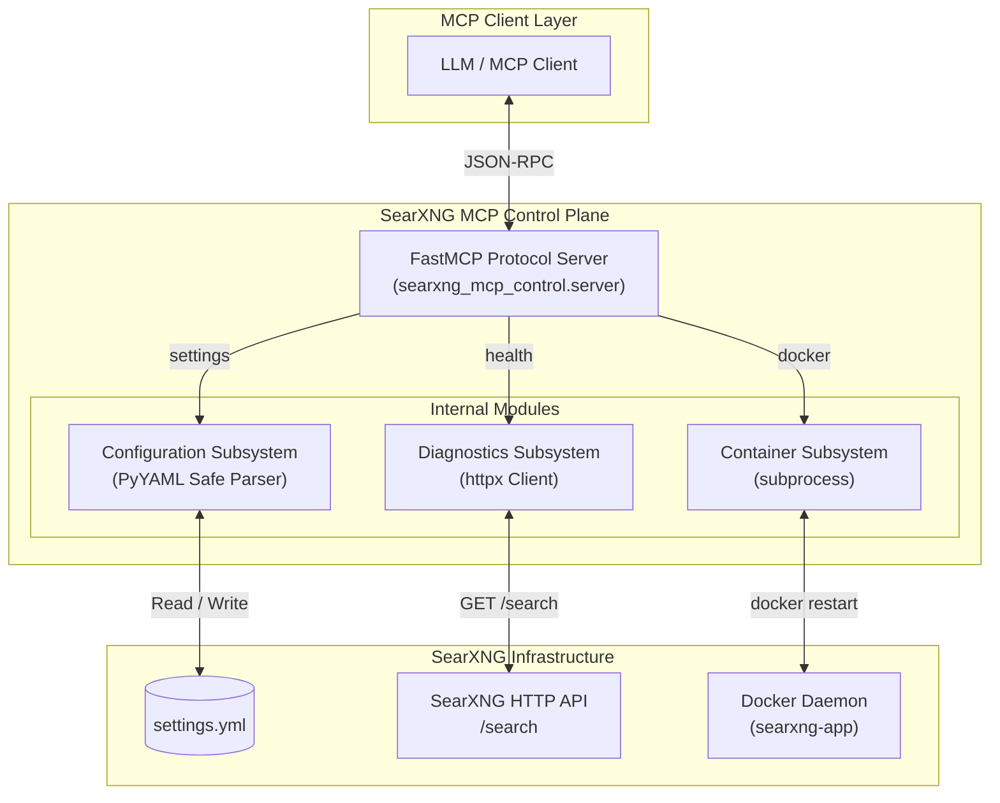

# Architecture

## 1. Executive Summary

The **SearXNG MCP Control Server** (`searxng-mcp-control`) is a Model Context Protocol (MCP) server designed to act as an automated control plane for self-hosted SearXNG metasearch instances. It acts as an intermediary, translating MCP tool calls into file modifications, HTTP requests, and Docker shell commands.

## 2. High-Level Architecture and Data Flow

The following Mermaid diagram illustrates the request lifecycle, showing how an MCP client interacts with the MCP Server, which in turn acts upon the underlying infrastructure.

## 3. Subsystem Logic and Algorithms

### 3.1. Configuration Management Subsystem

**Purpose:** Safe, bidirectional interaction with SearXNG's YAML configuration (`settings.yml`).

**Under-the-Hood Logic:**
- **Parsing:** Uses `yaml.safe_load()` to read the configuration file, mitigating arbitrary code execution risks inherent to YAML deserialization.
- **Data Transformation (Sanitization):** When parsing engines, it iterates through the `engines` list. It normalizes states:
  - Explicitly disabled engines (`disabled: True`).
  - Active engines (implicitly enabled if `disabled` is absent or `False`).
- **Mutation Engine (In-Place Updates):**
  - Uses a case-insensitive match against engine names (e.g., `target_name_lower = engine_name.strip().lower()`) to locate the engine in the parsed dictionary list.
  - If found, it flips the `disabled` Boolean property.
  - If not found, it appends a new engine definition to the list.
- **Serialization:** Employs `yaml.safe_dump(sort_keys=False, default_flow_style=False)` to persist changes while maximizing human readability and avoiding unexpected diffs.

### 3.2. Search API Health & Diagnostics Subsystem

**Purpose:** Automated validation of the SearXNG search endpoint.

**Under-the-Hood Logic:**
- **URL Normalization:** Analyzes the provided base URL, appending `/search` if missing, ensuring a valid endpoint is always targeted.
- **Latency Calculation:**
  - Implements a precise wall-clock latency measurement.
  - Mathematical model: `latency_ms = round((time.time() - start_time) * 1000, 2)`. This guarantees a metric in milliseconds with two decimal places precision.
- **Response Validation:**
  - Performs HTTP GET requests querying `?q=healthcheck&format=json`.
  - Checks if HTTP status code is 200.
  - Parses JSON response, extracts `results` array, counts elements, and samples up to 3 `title` strings for immediate visual confirmation of indexing health.
- **Error Handling:** Gracefully traps JSON parsing errors (`json.decoder.JSONDecodeError`), connection timeouts, and generic request exceptions, returning standardized JSON error envelopes.

### 3.3. Container Lifecycle Subsystem

**Purpose:** Direct control over the SearXNG Docker container.

**Under-the-Hood Logic:**
- **Execution Model:** Utilizes Python's `subprocess.run` to spawn a shell process executing `["docker", "restart", target_container]`.
- **Security & Stability:**
  - Uses a list of string arguments rather than `shell=True`, preventing shell injection vulnerabilities.
  - Applies a strict 30-second timeout (`timeout=30`).
- **Data Collection:** Captures `stdout` and `stderr`, wrapping standard Unix exit codes (where `0` is success) into boolean responses, while forwarding raw shell output to the caller for debugging.
